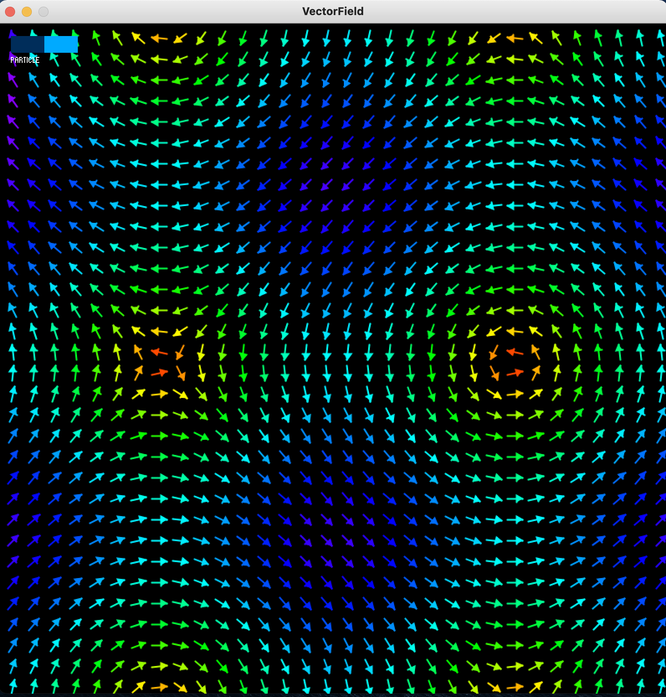
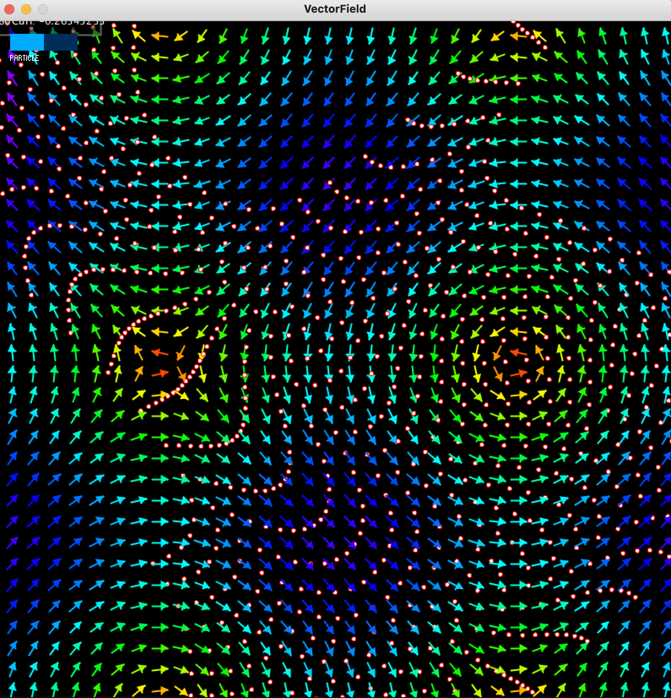
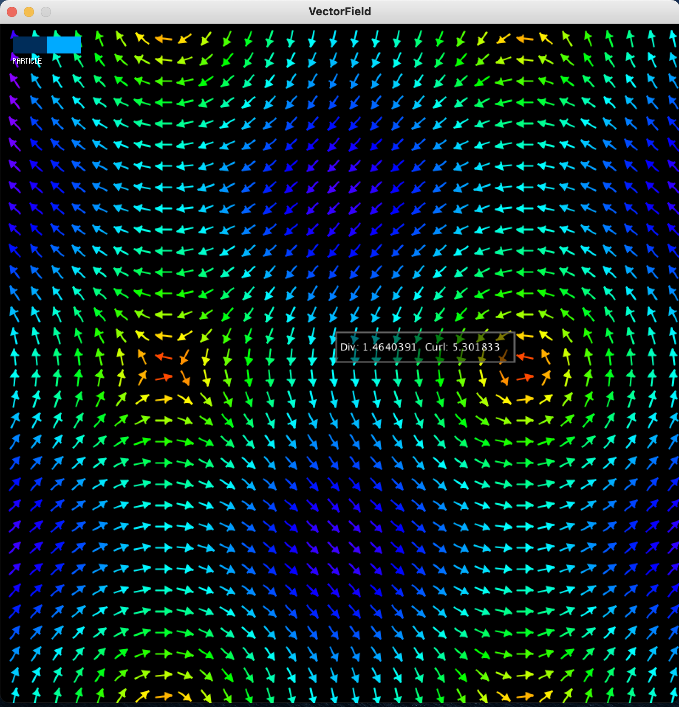

<h1 align="center">
  <br>
  Vector field visualizer
  <br>
</h1>

<p align="center">
  
</p>

<h4 align="center">A vector field visualizer coded in Java and Processing</h4>

<p align="center">
  <a href="#description">Description</a> •
  <a href="#features">Features</a> •
  <a href="#howto">How to use it</a> •
  <a href="#license">License</a>
</p>


## Description

Vector fields are fascinating mathematical objects. They have many applications mostly in physics to model electromagnetic fields, fluid flows, etc.

This vector field was created using Processing, a nice tool to create animations in Java.

<p align="center">
  
  
</p>


## Features

- Particle flows
- Computation of the curl and divergence at every point of the vector field


<p align="center">
  
</p>


## How to use it

Change the 94th line of the **VectorField.pde** file.

Formula: $(x, y) \rightarrow (sin(y), cos(x))$

```java

  return new PVector(sin(y), cos(x));

```

## License

MIT

---

> GitHub [@PABannier](https://github.com/PABannier) &nbsp;&middot;&nbsp;
> Twitter [@el_PA_B](https://twitter.com/el_PA_B)

